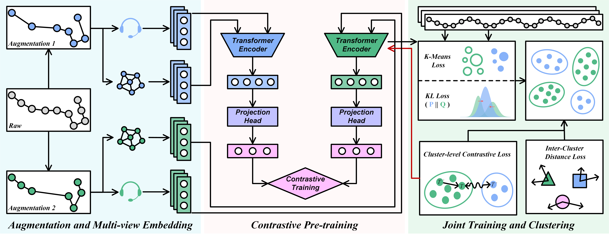

# CL-DFTC: Deep Flight Trajectory Clustering via Self-supervised Contrastive Learning

[](https://www.python.org/downloads/)

> A deep learning framework for flight trajectory clustering based on self-supervised contrastive learning and multi-view feature fusion.


## 🎯 Overview

CL-DFTC is a novel deep flight trajectory clustering framework that leverages:
- **Data Augmentation**: Employs trajectory simplification and shift augmentation strategies
- **Multi-View Feature Fusion Transformer (MVFTT)**: Captures both structural and semantic features
- **Self-supervised Contrastive Learning**: Pre-trains trajectory representations without labels
- **Joint Training**: Fine-tunes the model with clustering objectives

This framework is particularly effective for air traffic management, trajectory pattern mining, and anomaly detection in aviation.


## 🏗️ Architecture



## 📦 Installation

### Prerequisites

- Python 3.11 or higher
- CUDA 11.0+ (for GPU support)
- 8GB+ RAM recommended

### Setup

1. **Clone the repository**

```bash
git clone https://github.com/yourusername/CL-DFTC.git
cd CL-DFTC
```

2. **Create a virtual environment** (recommended)

```bash
# Using conda
conda create -n cldftc python=3.11
conda activate cldftc

# Or using venv
python -m venv venv
source venv/bin/activate  # On Windows: venv\Scripts\activate
```

3. **Install dependencies**

```bash
pip install -r requirements.txt
```

### Dependencies

Key packages include:
- `torch>=2.0.0` - Deep learning framework
- `numpy>=1.24.0` - Numerical computing
- `scikit-learn>=1.3.0` - Machine learning utilities
- `pandas>=2.0.0` - Data manipulation
- `pynvml` - GPU monitoring
- `psutil` - System monitoring

## 🚀 Quick Start

### Example Dataset

A sample dataset is provided in `data_pvg/pvg.csv` for quick testing.

### Step 1: Pre-training

Train the trajectory encoder using self-supervised contrastive learning:

```bash
python pre_training.py --dataset pvg
```

**What happens:**
- Loads trajectory data from `data_pvg/`
- Applies data augmentation (simplify + shift)
- Trains MVFTT encoder with MoCo framework
- Saves best model to `exp/snapshots/`

**Expected output:**
```
[Training] START! timestamp=...
[Training] ep=0: avg_loss=2.345, @=120.5/120.5, gpu=(4096, 8192), ram=2048
...
[Training] END! @=1200.5, best_epoch=8, best_loss_train=0.234
```

### Step 2: Joint Training (Clustering)

Fine-tune the pre-trained model with clustering objectives:

```bash
python joint_training.py --dataset pvg
```

**Prerequisites:** A pre-trained model checkpoint must exist (from Step 1).

**What happens:**
- Loads pre-trained encoder
- Initializes cluster centers with K-Means
- Jointly optimizes contrastive and clustering losses
- Saves embeddings and cluster assignments to `exp/embeddings/`

**Expected output:**
```
[Training] ep=1: acc=0.756, nmi=0.823, ari=0.701
[Training] ep=2: acc=0.812, nmi=0.867, ari=0.765
...
Best Epoch: 5, Best Acc: 0.891, Best Nmi: 0.923, Best Ari: 0.856
```

## 📊 Preprocessing Your Own Dataset


1. **Create a preprocessing script** (see `utils/preprocessing_pvg.py` as template)

2. **Update configuration** in `config.py`

3. **Run preprocessing**:

```bash
python utils/preprocessing_your_dataset.py
```


